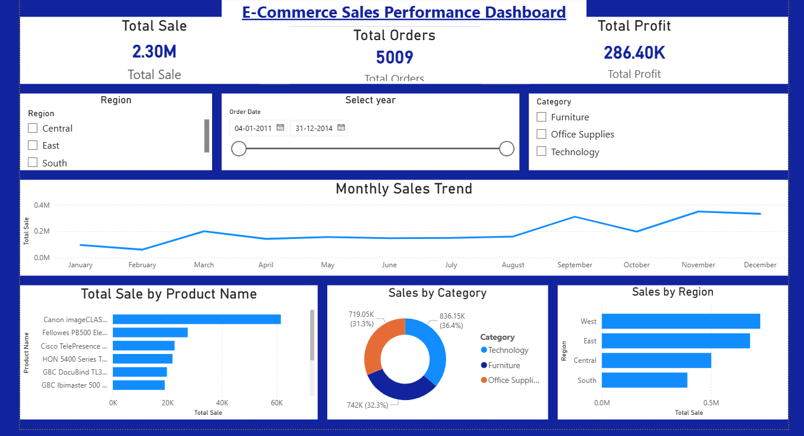

# Future_DS_01

  

# E-Commerce Sales Performance Dashboard (Power BI)

## Project Overview
This project focuses on building an interactive E-Commerce Sales Performance Dashboard using Power BI. The dashboard is designed to analyze sales, profit, and order trends across different regions, categories, and time periods.

## Objectives
- Analyze overall sales, profit, and order volume
- Identify monthly sales trends
- Understand category-wise and region-wise performance
- Highlight top-selling products
- Provide interactive filtering for insights

## Tools Used
- Power BI Desktop
- Microsoft Excel
- DAX (Data Analysis Expressions)

## Key Features
- KPI cards for Total Sales, Total Orders, and Total Profit
- Monthly sales trend using a line chart
- Sales by product, category, and region
- Interactive slicers for year, region, and category

## Approach
- Imported and cleaned sales data in Power BI
- Created calculated measures using DAX
- Built interactive visuals
- Applied design best practices

## Insights
- Seasonal sales trends observed
- Technology category leads in revenue
- West and East regions perform best

## Learning Outcomes
- Data preparation and cleaning
- KPI creation using DAX
- Dashboard design using Power BI

